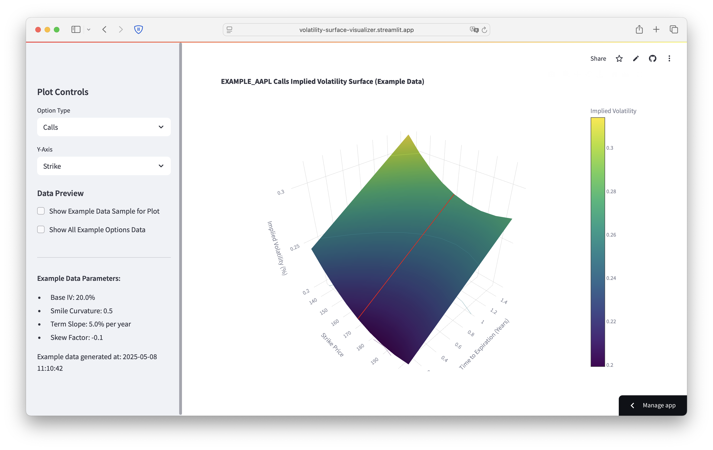

# Volatility Surface Visualizer

<!-- add screenshot -->


This Streamlit application visualizes the implied volatility surface for options, using synthetically generated example data. It provides an interactive 3D plot showing implied volatility as a function of strike price (or moneyness) and time to expiration.

This version uses pre-defined parameters to generate a sample volatility surface, making it easy to run and explore without external data dependencies or API rate limits.

## Features

*   **3D Volatility Surface Plot:** Interactive visualization of the implied volatility.
*   **Synthetic Data:** Uses internally generated example option data, ensuring consistent and predictable behavior.
*   **Option Type Selection:** View surfaces for "Calls" or "Puts".
*   **Flexible Y-Axis:** Display the surface against "Strike Price" or "Moneyness" (Strike / Current Price).
*   **Current Price Indication:** Shows a line on the surface representing the current (example) stock price when Y-axis is "Strike".
*   **Interactive Charts:** Powered by Plotly for zooming, panning, and hovering to inspect data points.
*   **Data Preview:** Option to view the raw generated data table within the app.
*   **Configurable Synthetic Data:** The parameters for generating the synthetic surface (base IV, smile, skew, term structure) are defined in the script and can be modified for experimentation.
*   **Efficient Caching:** Streamlit's caching is used for the generated data to speed up interactions.

## Requirements

*   Python 3.8+
*   The libraries listed in `requirements.txt`:
    *   streamlit
    *   pandas
    *   plotly
    *   numpy

## Installation

1.  **Clone the repository (or download the `app.py` script):**
    ```bash
    # If you have it in a git repo
    # git clone <repository-url>
    # cd <repository-name>
    ```

2.  **Create and activate a virtual environment (recommended):**
    ```bash
    python -m venv venv
    # On Windows
    # venv\Scripts\activate
    # On macOS/Linux
    # source venv/bin/activate
    ```

3.  **Install the required packages:**
    If a `requirements.txt` file is provided:
    ```bash
    pip install -r requirements.txt
    ```
    Otherwise, install them manually:
    ```bash
    pip install streamlit pandas plotly numpy
    ```

## Running the App

Once the dependencies are installed, navigate to the directory containing `app.py` and run:

```bash
streamlit run app.py